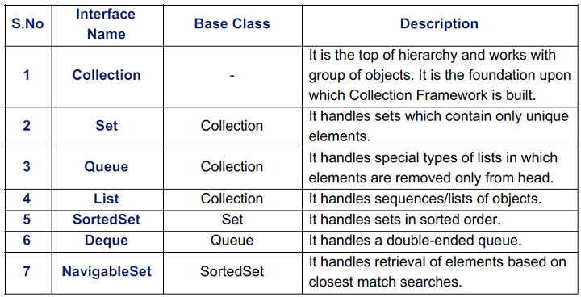

# Collections

**Java Collections Framework (JCF)** is a set of interfaces and classes in the `java.util` package that provides reusable data structures for storing, managing, and manipulating collections of objects.

The framework simplifies the development process by offering *ready-to-use data structures* and algorithms for common programming tasks.

---

## Interfaces

## Abstract classes

The Abstract Classes provide skeletal implementations that are used as starting points for creating concrete Collections.

## Concrete classes

- **AD [Allow Duplicates]**: It tells whether that particular collection allows duplicate values to be inserted.
- **AN [Allow Null]**: It tells whether null objects can be inserted into that particular collection.
- **Inserted Order:** It tells whether the objects are stored in the same order in which they were inserted.
- **Sorted Order:** It tells whether the objects are stored in sorted order.
- **Synchronized:** It tells whether the collection is thread-safe or not.
- **Random Access:** It tells whether the collection has a get() method to returns the index of an object or return the object using an index.
- **Default capacity:** The initial capacity of the collection when it is created using an empty constructor.

## Time Complexities

